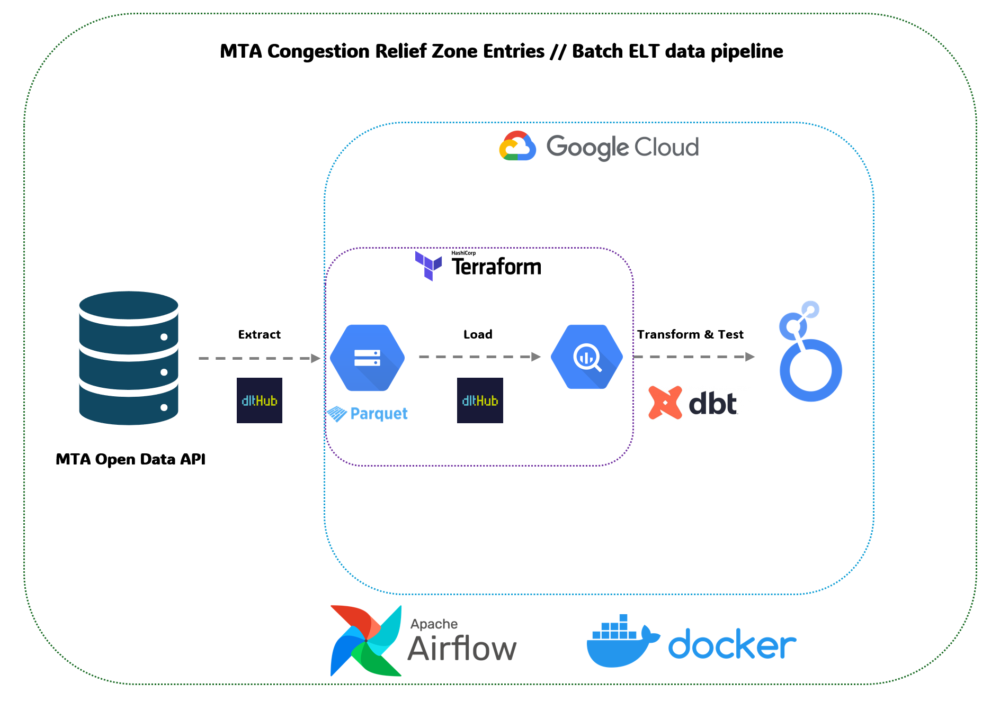

# MTA Congestion Relief Zone Entries Pipeline


## Overview
This project implements an end-to-end data pipeline for processing and analyzing the Metropolitan Transportation Authority (MTA)'s Congestion Relief Zone (CRZ) Vehicle Entries data. The MTA is New York City's primary public transportation authority, responsible for managing the city's subway, bus, and commuter rail systems, as well as implementing the new Congestion Pricing program in Manhattan.

Using modern data engineering practices, this pipeline transforms raw vehicle detection data from MTA's tolling system into actionable insights through dbt transformations and Looker Studio visualizations. The project specifically focuses on the Central Business District Tolling Program, which aims to reduce traffic congestion in Manhattan while generating revenue for public transportation improvements.

## Quick Links
- **Data Pipeline Repository**: [GitHub - mta-crz-entries-pipeline](https://github.com/kirill-developer/mta-crz-entries-pipeline)
- **Interactive Dashboard**: [Looker Studio - MTA CRZ Analysis](https://lookerstudio.google.com/reporting/889bfc1c-d8b1-4a6f-847f-66feecc5334b/page/BMzGF?s=tJcseHzgIdE)
- **Official Data Source**: [NY Open Data - MTA CRZ Vehicle Entries](https://data.ny.gov/Transportation/MTA-Congestion-Relief-Zone-Vehicle-Entries-Beginni/t6yz-b64h/about_data)

### Problem Statement
The MTA's Central Business District Tolling Program, launching in 2025, requires comprehensive traffic monitoring and analysis. This project creates an automated pipeline to process data from the 110 detection points around Manhattan's CRZ (south of 60th Street), enabling:

1. **Traffic Monitoring**: Process and analyze vehicle entries through tolling detection points
2. **Vehicle Classification**: Track entries by vehicle category (cars, trucks, TLC vehicles, etc.)
3. **Exemption Analysis**: Monitor exempt vs non-exempt roadway usage
4. **Peak Hour Analysis**: Process time-based entry patterns (peak vs off-peak)
5. **Entry Point Distribution**: Analyze traffic flow across different detection groups

### Data Source
The project uses the official MTA Congestion Relief Zone Vehicle Entries dataset, which provides:
- Vehicle detections from 110 monitoring points
- Entry classifications by vehicle type and location
- Temporal data in 10-minute intervals
- Distinction between CRZ and Excluded Roadway trips
- E-ZPass and license plate detection data

Data is accessed through MTA's OData v4 API, enabling batch processing of traffic patterns.

## Architecture


The pipeline follows a modern ELT (Extract, Load, Transform) approach:

1. **Extract**: Data is sourced from the MTA Open Data API using dlt (Data Load Tool)
2. **Load**: Raw data is loaded into Google BigQuery using Parquet format for efficient storage
3. **Transform**: Data transformations are handled by dbt, creating:
   - Staging models for initial data cleaning
   - Core models for business logic
   - Mart models for specific use cases and reporting

The entire pipeline is orchestrated using Apache Airflow and containerized with Docker, running on Google Cloud Platform.

## Data Processing

### Batch Processing
Daily ELT pipeline that:
1. Extracts data from MTA's Open Data API
2. Loads it into Google BigQuery
3. Transforms using dbt models for analysis

- **Processing Window**: T+1 (next day analysis)
- **Update Frequency**: Data refreshed daily at 2 AM EST
- **Historical Load**: Full historical data loaded on initial setup
- **Incremental Updates**: Daily delta loads for new data

## Infrastructure
The project infrastructure is managed with Terraform and is already set up in GCP. The configuration includes:

- Google Cloud Storage bucket for raw data storage
- BigQuery datasets and tables for data warehousing
- Airflow environment for orchestration
- IAM roles and service accounts
- Monitoring and alerting setup

To replicate this infrastructure in your environment:
1. Fork the repository
2. Update `terraform/variables.tf` with your GCP project details
3. Run:
```bash
cd terraform
terraform init
terraform plan    # Review the changes
terraform apply   # Apply the configuration
```

## Project Sharing & Setup

### GitHub Repository
The project code is available at: `https://github.com/kirill-developer/mta-crz-entries-pipeline`

### Required Access & Credentials
1. **Google Cloud**:
   - GCP Project with BigQuery and GCS enabled
   - Service account with appropriate permissions
   - Credentials JSON file

2. **MTA Data**:
   - Using OData v4 API
   - No authentication required
   - No rows limit per request

3. **Looker Studio**:
   - Access to the template dashboard: [Dashboard Link]
   - BigQuery connection permissions

### Dashboard Access
You can access the NYC Traffic Analysis dashboard here:
- [View Dashboard](https://lookerstudio.google.com/s/tJcseHzgIdE)

The dashboard provides interactive visualizations of:
- Total traffic entries into the congestion zone
- Traffic patterns by vehicle type
- Peak hour analysis
- Entry point distribution
- Exempt vehicle ratios

To use this dashboard with your own data:
1. Click the "Make a copy" button in the top right
2. Update the data source to connect to your BigQuery instance
3. Customize the visualizations as needed

### Local Development Setup
1. Clone the repository:
```bash
git clone https://github.com/kirill-developer/mta-crz-entries-pipeline.git
cd mta-crz-entries-pipeline
```

2. Set up configuration files:
```bash
# Environment variables
cp .env.example .env

# dbt configuration
cp dbt/profiles.yml.example dbt/profiles.yml

# Terraform variables
cp terraform/terraform.tfvars.example terraform/terraform.tfvars

# DLT configuration
cp config.toml.example config.toml
cp secrets.toml.example secrets.toml
```

3. Update the configuration files with your credentials:
   - `.env`: Set environment variables
   - `dbt/profiles.yml`: Configure BigQuery connection
   - `terraform/terraform.tfvars`: Set GCP project details
   - `config.toml`: Configure DLT pipeline settings
   - `secrets.toml`: Add GCP service account credentials

4. Infrastructure setup:
```bash
cd terraform
terraform init
terraform apply
```

5. Run the stack:
```bash
docker-compose up -d
```

## Running with Docker and Airflow

This project uses Docker to run Airflow and dbt. Here are the main commands:

### Starting the Environment
```bash
docker-compose up -d
```

### Running dbt Commands
All dbt commands should be run through Docker. Here are the main commands:

```bash
# Run dbt models
docker exec mta_crz_entries_airflow-webserver_1 dbt run --project-dir /opt/airflow/dbt --profiles-dir /opt/airflow/dbt

# Test dbt models
docker exec mta_crz_entries_airflow-webserver_1 dbt test --project-dir /opt/airflow/dbt --profiles-dir /opt/airflow/dbt

# Generate dbt docs
docker exec mta_crz_entries_airflow-webserver_1 dbt docs generate --project-dir /opt/airflow/dbt --profiles-dir /opt/airflow/dbt

# View model dependencies
docker exec mta_crz_entries_airflow-webserver_1 dbt list --select fact_traffic+ --project-dir /opt/airflow/dbt --profiles-dir /opt/airflow/dbt
```

### Project Structure
- `dbt/models/staging/` - Staging models that clean raw data
- `dbt/models/marts/core/` - Core models including fact_traffic and dimension tables
- `dbt/models/marts/business/` - Business-specific models like kpi_congestion and dashboard_traffic

### Data Flow
1. Raw data is ingested into BigQuery using Airflow
2. dbt transforms the data through:
   - Staging layer: Initial data cleaning
   - Core layer: Main fact and dimension tables
   - Business layer: Specific use-case models
3. Looker Studio connects to fact_traffic for the main dashboard
4. Additional models (kpi_congestion, dashboard_traffic) are available for future dashboards

## Data Quality Tests

The project includes comprehensive dbt tests to ensure data quality and consistency:

### Generic Tests
- Not-null validations for critical fields like dates, vehicle classes, and traffic counts
- Unique constraints on key dimensions (locations, dates)

### Custom Tests
- **Peak Hours**: Validates that all hour values are between 0 and 23
- **Vehicle Classes**: Ensures vehicle classes match expected categories (Cars/Vans, TLC, Trucks, Buses, etc.)
- **Non-negative Values**: Verifies that all entry counts are non-negative
- **Valid Dates**: Checks that no dates are in the future

Run tests using:
```bash
dbt test
```