# NYC Traffic Congestion Pricing Analysis

## Overview
This project analyzes NYC's Congestion Pricing traffic data using dbt and BigQuery, visualized through Looker Studio. It processes MTA's Congestion Relief Zone Vehicle Entries data to provide insights into traffic patterns, vehicle distributions, and exemption rates. The data is processed in daily batches, providing next-day insights for traffic patterns.

### Problem Statement
New York City is implementing a first-in-the-nation congestion pricing program to reduce traffic and raise revenue for public transit improvements. This project addresses several key challenges:

1. **Traffic Monitoring**: Track and analyze vehicle entries into Manhattan's Central Business District (CBD) south of 60th Street
2. **Vehicle Classification**: Monitor distribution of different vehicle types (cars, trucks, buses, etc.) entering the zone
3. **Exemption Analysis**: Track the proportion of vehicles that may be exempt from congestion pricing
4. **Peak Hour Identification**: Identify peak traffic periods to inform pricing strategies
5. **Entry Point Analysis**: Analyze which entry points experience the highest traffic volumes

### Data Source
The data comes from MTA's Congestion Relief Zone Vehicle Entries dataset, which includes:
- Daily vehicle entries by vehicle class
- Entry point locations and boroughs
- Temporal data (date and hour of entry)
- Exempt vs non-exempt vehicle counts
- Coverage of all major entry points into Manhattan's CBD

The data is updated daily and made available through MTA's OData v4 API, providing a reliable source for near real-time traffic analysis.

## Architecture

```mermaid
flowchart LR
    %% Nodes with icons/logos
    MTA["`🌐 MTA API`"]
    GCS["`☁️ Google Cloud Storage`"]
    BQ_RAW["`💾 BigQuery Raw`"]
    BQ_DWH["`🏭 BigQuery DWH`"]
    MARTS["`📊 Marts`"]
    LOOKER["`📈 Looker Studio`"]
    AIRFLOW["`🔄 Airflow`"]

    subgraph Ingestion
        direction TB
        MTA --> |dlt extract| GCS
        GCS --> |dlt load| BQ_RAW
    end

    subgraph Processing
        direction TB
        BQ_RAW --> |dbt transform| BQ_DWH
        BQ_DWH --> |dbt models| MARTS
    end

    subgraph Visualization
        MARTS --> |connect| LOOKER
    end

    subgraph Orchestration
        AIRFLOW --> |schedule| Ingestion
        AIRFLOW --> |trigger| Processing
    end

    %% Styling
    classDef cloud fill:#f5f5f5,stroke:#333,stroke-width:2px
    classDef process fill:#e1f5fe,stroke:#333,stroke-width:2px
    classDef viz fill:#f3e5f5,stroke:#333,stroke-width:2px
    classDef orch fill:#fff3e0,stroke:#333,stroke-width:2px
    
    class GCS,BQ_RAW,BQ_DWH cloud
    class MARTS process
    class LOOKER viz
    class AIRFLOW orch
```


## Data Processing
- **Batch Processing**: Daily ETL pipeline
- **Processing Window**: T+1 (next day analysis)
- **Update Frequency**: Data refreshed daily at 2 AM EST
- **Historical Load**: Full historical data loaded on initial setup
- **Incremental Updates**: Daily delta loads for new data

## Infrastructure
The project infrastructure is managed with Terraform and is already set up in GCP. The configuration includes:

- Google Cloud Storage bucket for raw data storage
- BigQuery datasets and tables for data warehousing
- Airflow environment for orchestration
- IAM roles and service accounts
- Monitoring and alerting setup

To replicate this infrastructure in your environment:
1. Fork the repository
2. Update `terraform/variables.tf` with your GCP project details
3. Run:
```bash
cd terraform
terraform init
terraform plan    # Review the changes
terraform apply   # Apply the configuration
```

## Project Sharing & Setup

### GitHub Repository
The project code is available at: `https://github.com/[your-username]/NYCTraffic_new`

### Required Access & Credentials
1. **Google Cloud**:
   - GCP Project with BigQuery and GCS enabled
   - Service account with appropriate permissions
   - Credentials JSON file

2. **MTA Data**:
   - Using OData v4 API
   - No authentication required
   - No rows limit per request

3. **Looker Studio**:
   - Access to the template dashboard: [Dashboard Link]
   - BigQuery connection permissions

### Dashboard Access
You can access the NYC Traffic Analysis dashboard here:
- [View Dashboard](https://lookerstudio.google.com/s/tJcseHzgIdE)

The dashboard provides interactive visualizations of:
- Total traffic entries into the congestion zone
- Traffic patterns by vehicle type
- Peak hour analysis
- Entry point distribution
- Exempt vehicle ratios

To use this dashboard with your own data:
1. Click the "Make a copy" button in the top right
2. Update the data source to connect to your BigQuery instance
3. Customize the visualizations as needed

### Local Development Setup
1. Clone the repository:
```bash
git clone https://github.com/[your-username]/NYCTraffic_new.git
cd NYCTraffic_new
```

2. Set up configuration files:
```bash
# Environment variables
cp .env.example .env

# dbt configuration
cp dbt/profiles.yml.example dbt/profiles.yml

# Terraform variables
cp terraform/terraform.tfvars.example terraform/terraform.tfvars

# DLT configuration
cp config.toml.example config.toml
cp secrets.toml.example secrets.toml
```

3. Update the configuration files with your credentials:
   - `.env`: Set environment variables
   - `dbt/profiles.yml`: Configure BigQuery connection
   - `terraform/terraform.tfvars`: Set GCP project details
   - `config.toml`: Configure DLT pipeline settings
   - `secrets.toml`: Add GCP service account credentials

4. Infrastructure setup:
```bash
cd terraform
terraform init
terraform apply
```

5. Run the stack:
```bash
docker-compose up -d
```

## Running with Docker and Airflow

This project uses Docker to run Airflow and dbt. Here are the main commands:

### Starting the Environment
```bash
docker-compose up -d
```

### Running dbt Commands
All dbt commands should be run through Docker. Here are the main commands:

```bash
# Run dbt models
docker exec nyctraffic_new_airflow-webserver_1 dbt run --project-dir /opt/airflow/dbt --profiles-dir /opt/airflow/dbt

# Test dbt models
docker exec nyctraffic_new_airflow-webserver_1 dbt test --project-dir /opt/airflow/dbt --profiles-dir /opt/airflow/dbt

# Generate dbt docs
docker exec nyctraffic_new_airflow-webserver_1 dbt docs generate --project-dir /opt/airflow/dbt --profiles-dir /opt/airflow/dbt

# View model dependencies
docker exec nyctraffic_new_airflow-webserver_1 dbt list --select fact_traffic+ --project-dir /opt/airflow/dbt --profiles-dir /opt/airflow/dbt
```

### Project Structure
- `dbt/models/staging/` - Staging models that clean raw data
- `dbt/models/marts/core/` - Core models including fact_traffic and dimension tables
- `dbt/models/marts/business/` - Business-specific models like kpi_congestion and dashboard_traffic

### Data Flow
1. Raw data is ingested into BigQuery using Airflow
2. dbt transforms the data through:
   - Staging layer: Initial data cleaning
   - Core layer: Main fact and dimension tables
   - Business layer: Specific use-case models
3. Looker Studio connects to fact_traffic for the main dashboard
4. Additional models (kpi_congestion, dashboard_traffic) are available for future dashboards

## Data Quality Tests

The project includes comprehensive dbt tests to ensure data quality and consistency:

### Generic Tests
- Not-null validations for critical fields like dates, vehicle classes, and traffic counts
- Unique constraints on key dimensions (locations, dates)

### Custom Tests
- **Peak Hours**: Validates that all hour values are between 0 and 23
- **Vehicle Classes**: Ensures vehicle classes match expected categories (Cars/Vans, TLC, Trucks, Buses, etc.)
- **Non-negative Values**: Verifies that all entry counts are non-negative
- **Valid Dates**: Checks that no dates are in the future

Run tests using:
```bash
dbt test
```